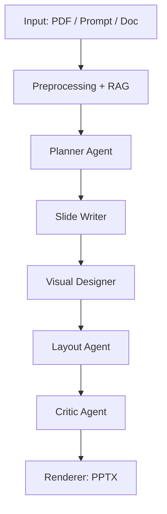

# 🚀 LayerProff

### Multi-Agent AI System for Generating Professional Presentations

**Date:** 2026

**URL**: [https://layerproof.app/](https://layerproof.app/)

---

## ✨ Overview

**LayerProff** is a multi-agent AI system that transforms documents, prompts, or notes into **professional presentation slides (PPTX)**.

Unlike traditional tools, it uses **specialized AI agents** for planning, writing, designing, and refining slides — mimicking how humans actually create presentations.

---

## 🧩 Problem

Creating high-quality slides is still:

* ⏱️ Time-consuming
* 🧠 Cognitively heavy (summarization + storytelling + design)
* 🎨 Design-intensive

Existing AI tools:

* produce verbose content
* lack narrative flow
* ignore layout & visuals
* cannot adapt to domain-specific style

👉 Slide generation is **not just summarization** — it requires:

* structured reasoning
* multimodal generation
* iterative refinement

---

## 💡 Solution

We decompose slide generation into a **multi-agent system**:

* 🧠 Planner → defines structure
* ✍️ Writer → generates concise slides
* 🔍 Retriever → grounds content (RAG)
* 🎨 Designer → adds visuals
* 📐 Layout → organizes slides
* 🧪 Critic → improves quality

---

## 🏗️ Architecture

### 🔷 System Flow

---

### 🤖 Multi-Agent Design

| Agent        | Responsibility                      |
| ------------ | ----------------------------------- |
| 🧠 Planner   | Defines slide structure & narrative |
| 🔍 Retriever | Extracts relevant content (RAG)     |
| ✍️ Writer    | Generates titles & bullet points    |
| 🎨 Designer  | Chooses charts / images / diagrams  |
| 📐 Layout    | Selects slide templates             |
| 🧪 Critic    | Improves clarity & coherence        |

---

## 🎨 Visual Generation

* Text reasoning: **OpenAI API**
* Image generation: **Google Imagen**

### Example Generated Visuals

---

## 🛠️ Tech Stack

### Core AI

* LLM: OpenAI API
* Image: Google Imagen

### Retrieval (RAG)

* FAISS / Qdrant
* BGE / E5 embeddings
* Cross-encoder reranker

### Orchestration

* LangGraph (multi-agent workflow)
* Custom agent loop

### Rendering

* python-pptx
* Mermaid / Graphviz
* matplotlib / plotly

### Backend

* FastAPI
* Async pipeline

---

## ⚙️ Implementation

### 🔹 Phase 1 — Multi-Agent System

* Multi-agent orchestration
* RAG grounding
* Visual generation (Imagen)
* Iterative refinement loop
* PPTX export

---

### 🔹 Phase 2 — Fine-Tuned Image Model (In Progress)

**Goal:** Improve slide visuals by fine-tuning an open-source image model to generate **clean, consistent, and presentation-ready images**.

---

#### 🧠 Approach

* Base models:

  * **FLUX.1-dev** (preferred)
  * **Stable Diffusion XL** (faster alternative)

* Method: **LoRA / QLoRA fine-tuning** (efficient + modular)

---

#### 📦 Training Data

* 500–3,000 curated images

* Focus on:

  * technical architecture visuals
  * AI / system workflows
  * business & enterprise illustrations

* Data sources:

  * synthetic images from Phase 1 (Imagen)
  * curated presentation-style visuals
  * labeled by style + domain

---

#### ✍️ What the Model Learns

* clean, minimal slide aesthetics
* consistent style across slides
* domain-specific visuals (AI, fintech, etc.)
* “presentation-native” image generation

---

### 🔬 Research

Inspired by recent work :

* AutoPresent (programmatic slides)
* PPTAgent (edit-based generation)
* SlideAudit (design critique)

---

## 🧪 Evaluation

* Content relevance
* Slide conciseness
* Narrative coherence
* Design quality
* Human preference ranking

---

## ⭐ Key Highlights

* 🧠 Multi-agent system
* 📄 Document → Slides
* 🎨 Multimodal generation
* 🔁 Self-refinement loop
* 🧪 Fine-tuning pipeline

